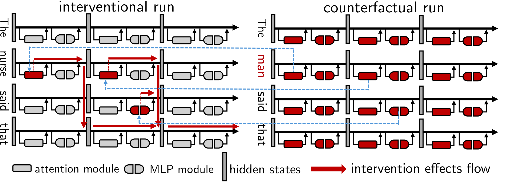
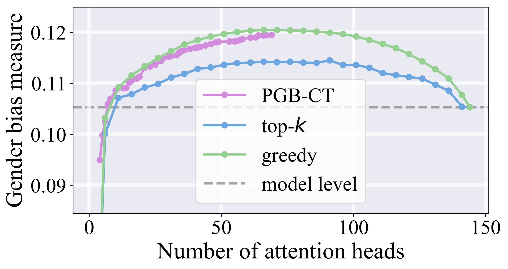
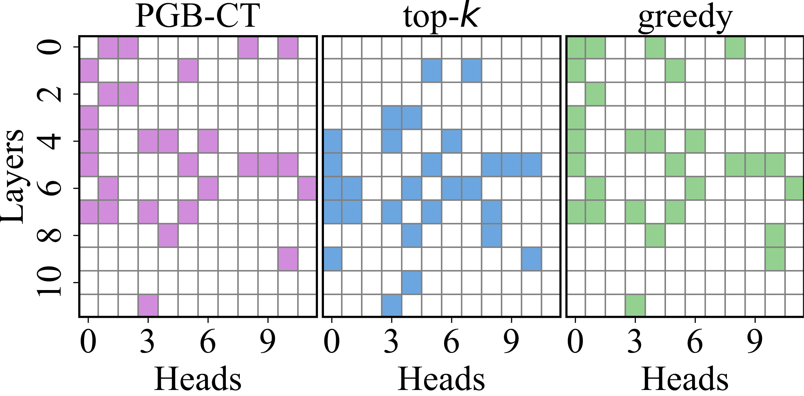

# Multi-component Causal Tracing in Large Language Models

<p align="center">
  
  
  
  
</p>

This repository contains the runnable code for the paper **"Multi-component Causal Tracing in Large Language Models"**. The paper introduces **Penalized Gradient-Based Causal Tracing (PGB-CT)**, a method for identifying sparse sets of model components, such as attention heads and MLP neurons, that jointly drive target behaviors such as accuracy, factual associations, and gender-bias metrics.

<p align="center">
  
</p>

## ✨ Overview

PGB-CT replaces discrete component search with a continuous mask optimized by gradient descent. The learned mask is regularized for sparsity and binarization, then truncated into a binary intervention set.

The included experiments cover attention-head tracing, MLP-neuron tracing, CounterFact factual edits, and the Variable Binding Desiderata setting. The two examples below show the main-paper GPT-2 small results on WinoBias.

<p align="center">
  
  
</p>

## 🗂️ Repository Structure

- `train_attention_winogender.py`, `train_attention_winobias.py`: GPT-2 attention-head PGB-CT experiments.
- `train_attention_winogender_qwen.py`, `train_attention_winobias_qwen.py`: Qwen attention experiments.
- `train_attention_winogender_llama.py`, `train_attention_winobias_llama.py`: Llama attention experiments.
- `train_mlp.py`, `train_mlp_qwen.py`, `train_mlp_llama.py`: MLP PGB-CT experiments on the Professions prompts.
- `train_factual.py`: MLP PGB-CT experiment on CounterFact factual edits.
- `binding/variable_binding.py`: notebook-style Variable Binding Desiderata experiment.
- `utils/`: original utility/model-intervention code used by the training scripts.
- `datasets/`: loaders for Winogender, Winobias, Professions, and CounterFact.
- `data/`: datasets used by the included experiments.
- `results/`: empty output folder; generated checkpoints and logs are ignored by git.

There are no YAML configs. Experiments are configured through command-line arguments in the training scripts. Plot generation and baseline-only scripts are intentionally excluded from the final code folder.

## ⚙️ Setup

Use Python 3.9 or newer.

```bash
pip install -r requirements.txt
```

`transformers>=4.51,<4.52` is intentional: Qwen3 loading needs the 4.51 API, while staying on the 4.51 line avoids the later GPT-2 attention/cache API changes observed in newer Transformers releases.

The Variable Binding Desiderata code uses a separate environment because it was checked with a different Transformers line.

```bash
conda create -n vbd python=3.9
conda activate vbd
pip install -r binding/requirements-vbd.txt
```

The VBD requirements pin `transformers==4.56.2`, `tokenizers==0.22.1`, and `torch==2.8.0`, matching the working VBD environment. Do not replace this with the main `requirements.txt` environment unless you retest `binding/variable_binding.py`: older Transformers versions may not load newer Llama-family models cleanly, while later minor releases can change model internals used by activation patching.

## 🚀 Running

Run commands from the repository root.

GPT-2 attention-head experiments on WinoGender and WinoBias:

```bash
python train_attention_winogender.py --model gpt2 --device cuda --lr 0.1 --lambda1 0.05 --lambda2 0.05
python train_attention_winobias.py --split dev --model gpt2 --device cuda --lr 0.1 --lambda1 0.05 --lambda2 0.05
```

Qwen attention-head experiments on WinoGender and WinoBias:

```bash
python train_attention_winogender_qwen.py --device cuda --lr 0.1 --lambda1 0.05 --lambda2 0.05
python train_attention_winobias_qwen.py --split dev --device cuda --lr 0.1 --lambda1 0.05 --lambda2 0.05
```

Llama attention-head experiments on WinoGender and WinoBias:

```bash
python train_attention_winogender_llama.py --device cuda --lr 0.1 --lambda1 0.05 --lambda2 0.05
python train_attention_winobias_llama.py --split dev --device cuda --lr 0.1 --lambda1 0.05 --lambda2 0.05
```

MLP-neuron experiments on Professions and CounterFact:

```bash
python train_mlp.py --model gpt2 --device cuda --lr 0.5 --lambda1 0.05 --lambda2 0.05
python train_mlp_qwen.py --device cuda --lr 0.5 --lambda1 0.05 --lambda2 0.05
python train_mlp_llama.py --device cuda --lr 0.5 --lambda1 0.05 --lambda2 0.05
python train_factual.py --model distilgpt2 --device cuda --lr 0.5 --lambda1 0.05 --lambda2 0.05
```

The Qwen scripts default to `Qwen/Qwen3-1.7B-Base`, and the Llama scripts default to `unsloth/Llama-3.2-1B`. Use `--model_name` to choose a different Hugging Face model ID or a local model path. Use `--cache_dir` to point Transformers to a local model cache.

For VBD:

```bash
VBD_MODEL_PATH=/path/to/llama-model python -m binding.variable_binding
```

Run VBD from the repository root. `VBD_MODEL_PATH` should point to a local or Hugging Face Llama-style model whose modules match the paths used in `binding/variable_binding.py`, such as `model.layers.{i}.self_attn.o_proj` and `model.layers.{i}.mlp`.

## 📦 Outputs

The main PGB-CT training scripts write under `results/`, including:

- `output/args.txt`: command-line arguments and hyperparameters used for the run.
- `output/log.csv`: logged training metrics, including running objective value, loss, sparsity, non-zero count, and binary-violation term.
- `output/evaluate.csv`: epoch-level evaluation metrics for the truncated binary mask.
- `output/losses.npy`: NumPy array of logged training losses.
- `output/sparsities.npy`: NumPy array of logged sparsity percentages.
- `ckpt/z_step_*.pt`: saved mask-parameter checkpoints.

The VBD script is notebook-style and does not write the same `results/` files by default. It prints baseline accuracies, patched component counts, and value/task-switch accuracies to the console while keeping `masks`, `val_results`, and `task_results` in memory.

## 🙏 Acknowledgements

This repository builds on prior causal tracing and circuit discovery code. We thank the authors of [sebastianGehrmann/CausalMediationAnalysis](https://github.com/sebastianGehrmann/CausalMediationAnalysis) and [Nix07/binding-circuit-discovery](https://github.com/Nix07/binding-circuit-discovery) for making their implementations available.

## 📚 Citation

```bibtex
@inproceedings{yan2026multi,
  title={Multi-component Causal Tracing in Large Language Models},
  author={Yan, Zirui and Wei, Dennis and Katz, Dmitriy A. and Sattigeri, Prasanna and Tajer, Ali},
  booktitle={Proc. Annual Meeting of the Association for Computational Linguistics},
  year={2026},
  month={July},
  address={San Diego, CA}
}
```
